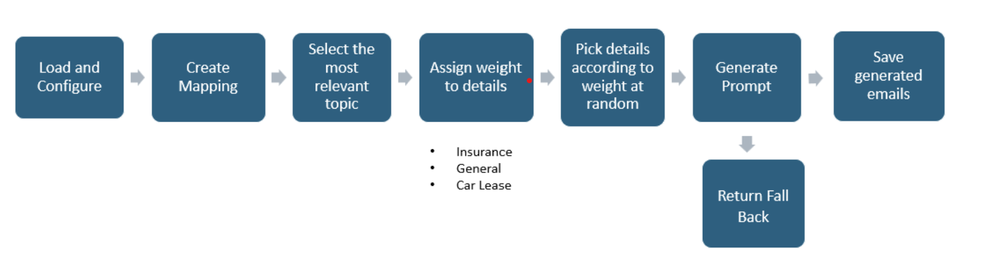

# TEAM PHISHNET

## :classical_building: Description

This project was built as a part of the proximus usecase exploring the usage of GenAI to generate personalized emails and deliver them through Gophish, an opensource tool with abilities to send and track user behavior. 


##	:building_construction: Repo Structure
```
¦   config.json
¦   get_email.py
¦   gophish_api.py
¦   gophish_apiv2.py
¦   gophish_constructor.py
¦   pipeline.py
¦   prompt-notebook.ipynb
¦   scrape_execs.py
¦   requirements.txt
¦   README.md
+---assets
¦       base_html_page.html
¦       email.json
¦       emails.json
¦       emails_streamlit.json
¦       email_html_template.html
¦       email_rules.json
¦       EmployeeInfo.json
¦       employee_details.json
¦       execs.json
¦       fallback.json
¦       from_streamlit.json
¦       phishnet_logo-modified.png
¦       
+---gophish_single_campaign
¦       get_email.py
¦       pipeline.py
¦       single_campaign.py
¦       
+---Notebooks
¦       creating_landing_pages.ipynb
¦       gemini_pipeline_test.ipynb
¦       gophish_constructor.ipynb
¦       
+---streamlit
        app.py
        style.css
```

## 🛎️ How to use?
1. Clone the repo and install the requirements.txt into a virtual environment.
2. Create a .env files with the GEMINI_API_KEY, GOPHISH_API_KEY and GMAIL_USERNAME.
3. Install Gophish from [here](https://github.com/gophish/gophish/releases).
4. Run Gophish.
5. Use the below command to run the streamlit app:

```
streamlit run streamlit/app.py
```
5. Enter employee details or upload a json file containing details to initiate a bulk send. Example json can be found in assets/EmployeeInfo.json.

## :satellite: Functionalities
1. Personalized email generated for each user generated everytime time send email is clicked.
2. Send email through gophish and track opens/sends.
3. Show personalized reasons why an email was a phishing email for employee education if they click on the link, generated by Gen AI.
4. UI Layer for easy usage of the tool.

## :gear: Prompt Engineering:


## :whale: Gophish Snap shots:


## :computer: UI and Explanation Examples:


